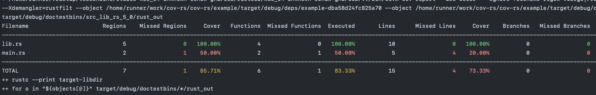

# Rust Source-based Code Coverage

[](https://github.com/duyet/cov-rs/actions/workflows/test.yaml)

A source-based code coverage enabled with `-C instrument-coverage`, 
which uses LLVM's native, efficient coverage instrumentation to generate very precise coverage data.


# Usage

```bash
bash <(curl -s https://raw.githubusercontent.com/duyet/cov-rs/master/cov.sh)
```

# Github Workflows

See [.github/workflows/test.yaml](.github/workflows/test.yaml) for example

```yaml
on:
  push:
    branches: [master]
  pull_request:
    branches: [master]

jobs:
  build:
    runs-on: ${{ matrix.os }}
    strategy:
      matrix:
        os: [ubuntu-latest, macos-latest]
    steps:
      - name: Checkout
        uses: actions/checkout@v3

      - name: Rust Toolchain
        uses: actions-rs/toolchain@v1
        with:
          toolchain: stable

      - name: Code Coverage
        env:
          GITHUB_PULL_REQUEST: ${{ github.event.pull_request.number }}
        run: |
          export GITHUB_PULL_REQUEST=${{ env.GITHUB_PULL_REQUEST }}
          export GITHUB_TOKEN=${{ secrets.GITHUB_TOKEN }}
          export PROJECT_TITLE="Example build on ${{ matrix.os }}"
          cd example && bash <(curl -s https://raw.githubusercontent.com/duyet/cov-rs/master/cov.sh)
```

The coverage report will be shown at Github Actions [logs](https://github.com/duyet/cov-rs/runs/5959116619?check_suite_focus=true).



## Comment on Github pull requests

If you set the `GITHUB_PULL_REQUEST`, `GITHUB_TOKEN` 
and `PROJECT_TITLE` (optional), the coverage script will comment the cov report on PR, for example: 
https://github.com/duyet/cov-rs/pull/3#issuecomment-1094174485


# License

MIT
