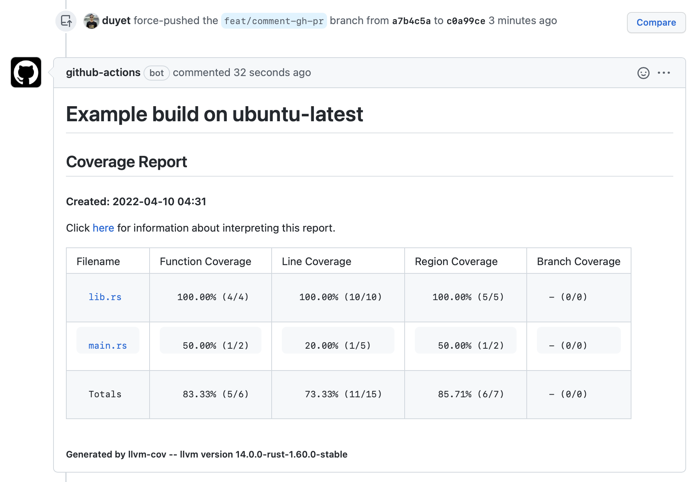
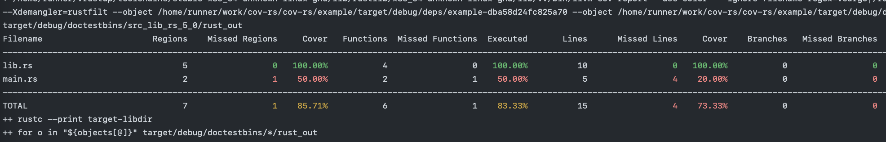

# Rust Source-based Code Coverage

[](https://github.com/duyet/cov-rs/actions/workflows/test.yaml)

A lightweight, zero-dependency tool for Rust code coverage using LLVM's native instrumentation (`-C instrument-coverage`). Get precise, source-based coverage reports with a single command.

## Features

✨ **One-line installation** - No configuration files needed
🔒 **Secure by design** - No eval, proper variable quoting, validated inputs
🚀 **Fast** - Direct LLVM instrumentation with minimal overhead
📊 **Rich reports** - Both terminal and HTML coverage reports
🤖 **CI-native** - Built for GitHub Actions with PR commenting
🌍 **Cross-platform** - Works on Linux, macOS, and Windows
📦 **Workspace support** - Handles Cargo workspaces out of the box
🎯 **Coverage thresholds** - Fail builds below minimum coverage

## Quick Start

```bash
# Generate coverage report in current directory
bash <(curl -s https://raw.githubusercontent.com/duyet/cov-rs/master/cov.sh)
```

Or download and run locally:

```bash
curl -O https://raw.githubusercontent.com/duyet/cov-rs/master/cov.sh
chmod +x cov.sh
./cov.sh
```

## Usage

### Basic Usage

```bash
# Generate coverage report
./cov.sh

# Clean previous coverage data
./cov.sh -c

# Fail if coverage is below 80%
./cov.sh -t 80

# Show help
./cov.sh -h
```

### GitHub Actions Integration

Add this to your `.github/workflows/test.yaml`:

```yaml
name: Coverage

on:
  push:
    branches: [main, master]
  pull_request:

jobs:
  coverage:
    runs-on: ubuntu-latest
    steps:
      - uses: actions/checkout@v4

      - uses: dtolnay/rust-toolchain@stable

      - name: Generate Coverage
        run: bash <(curl -s https://raw.githubusercontent.com/duyet/cov-rs/master/cov.sh)

      - name: Upload Coverage Report
        uses: actions/upload-artifact@v4
        with:
          name: coverage-report
          path: target/cov/
```

### PR Comments (GitHub Actions)

Automatically comment coverage reports on pull requests:

```yaml
- name: Coverage with PR Comment
  env:
    GITHUB_PULL_REQUEST: ${{ github.event.pull_request.number }}
    GITHUB_TOKEN: ${{ secrets.GITHUB_TOKEN }}
    GITHUB_REPOSITORY: ${{ github.repository }}
    PROJECT_TITLE: "Code Coverage Report"
  run: bash <(curl -s https://raw.githubusercontent.com/duyet/cov-rs/master/cov.sh)
```

Example PR comment: https://github.com/duyet/cov-rs/pull/3#issuecomment-1094174485



### Coverage Thresholds

Enforce minimum coverage requirements:

```bash
# Fail if coverage is below 80%
./cov.sh -t 80

# In CI
./cov.sh --threshold 90
```

## Requirements

- **Rust toolchain** (cargo, rustup, rustc) - [Install from rustup.rs](https://rustup.rs/)
- **jq** - JSON processor (auto-installed on most platforms)
- **Nightly Rust** - Automatically installed by the script

The script will automatically:
1. Install Rust nightly toolchain
2. Install LLVM tools preview
3. Install rustfilt for symbol demangling

## Output

### Terminal Report

The script outputs a colorized coverage summary:



### HTML Report

Interactive HTML report is generated at `target/cov/index.html` and automatically opens in your browser:

- Line-by-line coverage
- Function coverage
- Region coverage
- Source code with highlighting

## Environment Variables

| Variable | Description | Required | Example |
|----------|-------------|----------|---------|
| `GITHUB_PULL_REQUEST` | PR number for commenting | No | `123` |
| `GITHUB_TOKEN` | GitHub API token | No* | `${{ secrets.GITHUB_TOKEN }}` |
| `GITHUB_REPOSITORY` | Repository (owner/name) | No* | `duyet/cov-rs` |
| `PROJECT_TITLE` | Report title | No | `My Project Coverage` |

\* Required only for PR commenting

## Troubleshooting

### Tests not found

**Problem:** `Warning: No test binaries found`

**Solution:** Ensure your project has tests:
```rust
#[cfg(test)]
mod tests {
    #[test]
    fn test_something() {
        assert_eq!(2 + 2, 4);
    }
}
```

### No profraw files

**Problem:** `Error: No profraw files found`

**Solution:** Tests may have failed. Check test output in `target/test-output.log`

### LLVM tools not found

**Problem:** `Error: llvm-profdata not found`

**Solution:** Install LLVM tools:
```bash
rustup component add llvm-tools-preview --toolchain nightly
```

### Permission denied (jq installation)

**Problem:** Cannot install jq automatically

**Solution:** Install jq manually:
- **Ubuntu/Debian:** `sudo apt-get install jq`
- **macOS:** `brew install jq`
- **Windows:** `choco install jq`

### Windows: Script fails

**Problem:** Script doesn't run on Windows

**Solution:** Use Git Bash or WSL:
```bash
# Git Bash
bash cov.sh

# WSL
wsl bash cov.sh
```

## Advanced Usage

### Cargo Workspaces

The script automatically detects and handles Cargo workspaces. No configuration needed.

### Custom Ignore Patterns

Edit the `IGNORE` variable in `cov.sh` to exclude files:

```bash
IGNORE=".cargo|/rustc|.rustup|target|vendored"
```

### Integration with Coverage Services

Export coverage data for external services:

```bash
# Generate coverage
./cov.sh

# Convert to lcov format (requires llvm-cov)
llvm-cov export --format=lcov \
  --instr-profile=target/default.profdata \
  target/debug/your-binary > coverage.lcov

# Upload to codecov
bash <(curl -s https://codecov.io/bash)
```

## How It Works

1. **Setup:** Installs Rust nightly and LLVM tools
2. **Instrument:** Compiles tests with `-C instrument-coverage`
3. **Execute:** Runs tests, generating `.profraw` files
4. **Merge:** Combines profraw files into `.profdata`
5. **Report:** Uses `llvm-cov` to generate reports
6. **Comment:** (Optional) Posts results to GitHub PR

## Philosophy

Read [CLAUDE.md](CLAUDE.md) to understand the design principles behind this tool.

## Examples

See the [example/](example/) directory for a complete working example with:
- Unit tests
- Integration tests
- Doc tests
- Clippy configuration
- Rustfmt configuration

## Comparison with Alternatives

| Feature | cov-rs | tarpaulin | grcov |
|---------|--------|-----------|-------|
| Installation | curl | cargo install | cargo install |
| Setup time | ~30s | ~5min | ~5min |
| Config required | No | Optional | Yes |
| Workspace support | Yes | Yes | Yes |
| Windows support | Yes | No | Yes |
| PR comments | Built-in | Manual | Manual |

## Contributing

Contributions welcome! Please ensure:

1. shellcheck passes: `shellcheck cov.sh`
2. Tests pass: `cd example && cargo test`
3. Example works: `cd example && ../cov.sh`

## Resources

- [Rust instrumentation-based coverage](https://doc.rust-lang.org/rustc/instrument-coverage.html)
- [LLVM coverage mapping](https://llvm.org/docs/CoverageMappingFormat.html)
- [GitHub Actions documentation](https://docs.github.com/en/actions)

## License

MIT License - see [LICENSE](LICENSE) file for details

## Changelog

See [GitHub Releases](https://github.com/duyet/cov-rs/releases) for version history

---

**Made with ❤️ by [@duyet](https://github.com/duyet)**

*Simple tools for complex problems*
